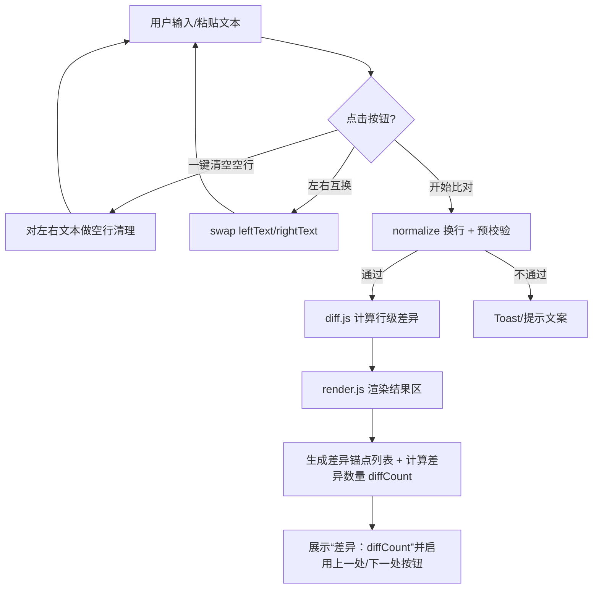

# Spec（Phase 2 - Design）：树园的工具导航（首期：文本比对 MVP）

> 版本：v0.1（设计蓝图稿）
>
> Phase 1 需求已确认，用户口头指令“继续开发”。本设计稿将把 MVP 的技术方案与交互方案固化，便于进入任务拆解与实现。

## 0. 设计前置：我做的关键默认决策（如需改随时说）

1) 「一键清空空行」默认作用范围：**两侧同时清理**（更省操作，更符合“工具按钮”的直觉）。
2) 一侧为空时：**允许比对**（表现为“全新增/全删除”），并在结果区给出轻提示（例如“右侧为空：左侧内容视为全部删除”）。

## 1. 技术选型（KISS + 好部署 + 本地隐私）

### 1.1 技术栈（MVP）
- 形态：**纯静态单页**（Static Site）
- 前端：HTML + CSS + 原生 JavaScript（ESM）
- 不引入框架（React/Vue）与重型构建工具（降低新手维护难度）
- 比对算法：**行级 diff（本地计算）**  
  - 方案：基于 LCS（最长公共子序列）的行级差异计算
  - 不依赖后端，不上传文本

> 为什么不用第三方 diff 库：  
> 1) 你偏向 KISS；2) 依赖越少越好部署/越放心；3) 行级 diff 用 LCS 实现可控且足够稳定。

### 1.2 可选增强（非 MVP）
- 词/字符级 diff 高亮（实现复杂度与性能成本更高）
- 忽略空白差异、忽略大小写等开关
- localStorage 自动保存草稿（个人效率提升）

## 2. 信息架构与页面规划（单页但“有导航感”）

页面自上而下的结构：
1) Header：标题「树园的工具导航」+ 一句隐私说明（“本地比对，不上传文本”）
2) Tool Switch（轻导航）：单行“工具标签/Segmented Control”
   - 文本比对（active）
   - Coming soon（disabled）
3) Workspace（工作台）：双栏输入 + 工具条 + 结果区
4) Footer：版本号/署名（弱化）

## 3. 关键交互（Interaction）

### 3.1 双栏输入
- 左侧：原文本（可编辑 textarea）
- 右侧：对比文本（可编辑 textarea）
- 桌面端并排；移动端上下排列

### 3.2 工具条（按钮组）
按钮从左到右（推荐顺序）：
1) 开始比对（Primary）
2) 上一处 / 下一处（Secondary，禁用态：无差异时）
3) 一键清空空行（Secondary）
4) 左右互换（Icon button）
5) 清空（Icon button，二次确认或长按可选，MVP 可先不做确认）

### 3.3 结果区（只读、可滚动、可定位）
- 结果区展示“行级 diff”
- 结果区顶部应显示“差异数量”统计（例如：`差异：0` / `差异：12`），用于快速判断是否有改动
- 新增行（右侧新增）：绿色底/绿边标记
- 删除行（左侧删除）：红色底/红边标记
- 未变化行：浅灰字或常规字，弱化存在感
- 差异导航：
  - 计算 diff 时记录每个差异块的 DOM 节点 id
  - “上一处/下一处”滚动到对应节点并短暂高亮（闪烁/描边 600ms）

### 3.4 同步滚动（可选，建议做）
- 左右输入框同步滚动：当用户滚动左侧，右侧跟随到相同比例
- 结果区单独滚动（不强制跟输入框同步，避免复杂）

## 4. 视觉设计（Apple 风的“克制炫酷”落点）

### 4.1 字体与排版
- 字体：系统无衬线栈（接近苹果官网体验）
  - `ui-sans-serif, system-ui, -apple-system, BlinkMacSystemFont, "Segoe UI", Roboto, "Helvetica Neue", Arial`
- 标题：大字号（32-44px）、字重 600-700、紧凑行高
- 正文说明：14-16px、字重 400-500、灰度文字

### 4.2 色彩与材质
- 背景：浅灰近白（如 #F5F5F7），叠加极淡径向渐变（“炫酷感”来自材质，不是花色）
- 卡片：白色 + 轻阴影 + 1px 细描边（玻璃感很轻，不走夸张拟态）
- 强调色：Apple 蓝系（按钮/焦点态）

### 4.3 动效（只做“高级感”必需的）
- 页面进入：工作台淡入 + 上移 6px（200-300ms）
- 按钮 hover：阴影/亮度微调（150ms）
- 差异跳转：目标差异块描边高亮（600ms）  

> 动效原则：少、快、克制；以“反馈”为目的，不做花哨表演。

## 5. 数据流与模块划分（实现可维护）

### 5.1 状态（in-memory）
- `leftText: string`
- `rightText: string`
- `diffResult: Array<DiffLine>`（计算结果）
- `diffAnchors: string[]`（差异块 id 列表）
- `activeAnchorIndex: number`
- `diffCount: number`（差异数量展示用，0 表示无差异）

`DiffLine` 建议结构：
```ts
type DiffOp = "equal" | "insert" | "delete";
type DiffLine = { op: DiffOp; left?: string; right?: string };
```

### 5.2 模块拆分（文件层面）
```
/
  index.html
  assets/
    app.css
  src/
    app.js          # 事件绑定、状态管理、渲染调度
    diff.js         # 行级 LCS diff
    sanitize.js     # 清空空行/规范化换行
    render.js       # 把 diffResult 渲染成 DOM
```

## 6. 核心流程（Mermaid）



## 7. 异常与容错（新手友好）
- 输入校验失败（两侧都空）：只提示，不报错
- 文本过长：给出提示并建议分段（MVP 可先软提示，不强制限制）
- diff 计算异常：try/catch 捕获，结果区展示“计算失败，请重试”，并在控制台输出可读日志

## 8. 验证方式（开发阶段）
- 手动验证清单：
  1) 左右输入粘贴文本 → 点击开始比对 → 结果区出现高亮差异
  2) 点击“下一处”能逐个跳转差异
  3) 点击“一键清空空行”能删除空行（含仅空格行）
  4) 移动端宽度下布局自动变上下

## 9. 部署设计（先给结论，细步骤放 Phase 5）
- 由于是纯静态站点，可部署到：GitHub Pages / Vercel / Cloudflare Pages
- 也可以直接丢到任意对象存储（COS/OSS）+ CDN
